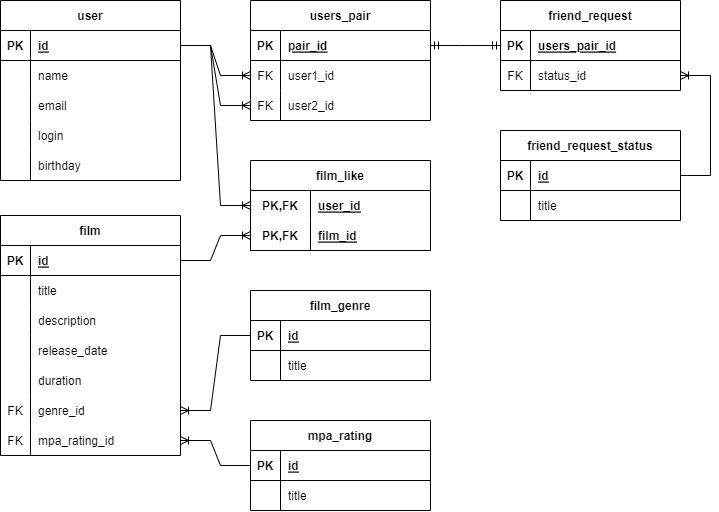

# java-filmorate

## Схема базы данных

В схеме присутствуют две основные таблицы: **user** и **film**.
На их основе строются связующие таблицы, описывающие различного рода связи между ними:
    
- **film_like**, для подсчета лайков фильмов от пользователей.
- **users_pair**, для описания связей между двумя пользователями, 
  например статус запроса в друзья (таблица **friend_request**).

Также отражены таблицы несущие справочный характер (напр. **film_genre** и **friend_request_status**)



### Примеры запросов
```sql

-- Запрос списка друзей для пользователя с id=4

SELECT friend.*
FROM user AS user
  INNER JOIN users_pair AS up ON up.user1_id <> up.user2_id
  AND (user.id = up.user1_id
    OR user.id = up.user2_id)
  INNER JOIN friend_request AS fr ON up.pair_id = fr.users_pair_id
  INNER JOIN user AS friend ON friend.id = up.user1_id
                            OR friend.id = up.user2_id
WHERE fr.status_id = 2 -- заявка в друзья принята
  AND user.id = 4 
```

```sql
-- Запрос фильмов определенного жанра

SELECT *
FROM film AS film
INNER JOIN film_genre AS genre ON film.genre_id = genre.id
WHERE genre.title = "Драма"
```

```sql
-- Топ 100 фильмов по популярности

SELECT film.title AS title,
	   COUNT(fl.id) AS likes
COUNT(film_id)
FROM film AS film
LEFT OUTER JOIN film_like AS fl ON film.id = fl.film_id
GROUP BY title
ORDER BY likes DESC
LIMIT 100
```